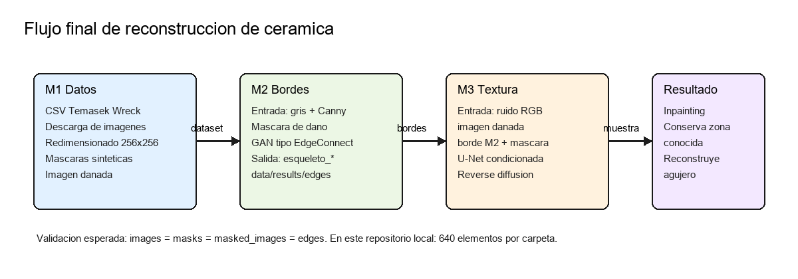
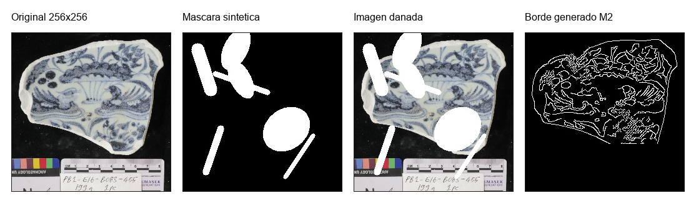

# Prediccion de areas faltantes en ceramica antigua mediante GAN y difusion inversa

Repositorio: https://github.com/guti-48/reconstruccion-jarrones.git

## Resumen

Este proyecto estudia una tuberia de reconstruccion 2D de ceramica antigua a partir de imagenes con zonas perdidas. El objetivo no es reconstruir una vasija 3D completa, sino completar regiones ausentes en fotografias de fragmentos ceramicos. Para ello se combinan dos ideas: una GAN que predice la estructura de bordes dentro de la zona danada y un modelo de difusion inversa que usa esos bordes como condicion para reconstruir color y textura.

La aproximacion final se divide en tres bloques. M1 prepara las imagenes y mascaras; M2 genera los esqueletos o bordes faltantes con una GAN inspirada en EdgeConnect; y el entrenamiento integrado M2 -> M3 parte de M2 ya entrenado para entrenar una U-Net de difusion condicionada por imagen danada, mascara y borde generado.



## Datos

La fuente de datos usada es el conjunto de imagenes del Temasek Wreck, descargado a partir del CSV `temasekwreck-temasekblueandwhites.csv` y de la ruta publica `https://epress.nus.edu.sg/sitereports/temasekwreck/images/`. El script `scripts_m1/descargaImagenes.py` filtra piezas con estado y forma adecuados para el problema: platos, cuencos, platillos y cubiertas con una vista suficientemente limpia.

El preprocesamiento se realiza con `scripts_m1/preprocesamiento.py`. Cada imagen se redimensiona a 256x256 pixeles y se crea una mascara sintetica de dano. La mascara contiene grietas lineales y zonas elipticas, lo que permite simular perdidas de material sobre piezas que originalmente estan completas o casi completas.

Estructura de datos final:

| Carpeta | Contenido | Numero local |
| --- | --- | --- |
| `data/processed/images` | Imagen limpia 256x256 | 640 |
| `data/processed/masks` | Mascara binaria del dano | 640 |
| `data/processed/masked_images` | Imagen con dano sintetico | 640 |
| `data/results/edges` | Bordes generados por M2 | 640 |



## Metodologia

### M1: descarga, limpieza y mascaras

M1 descarga las imagenes desde el repositorio del Temasek Wreck, filtra piezas segun metadatos del CSV y genera tres salidas sincronizadas: imagen limpia, mascara e imagen danada. Esta etapa es determinante porque el resto del sistema asume que los tres archivos comparten nombre y dimensiones.

La mascara se interpreta como:

| Valor | Significado |
| --- | --- |
| 0 | Zona conocida |
| 255 / 1.0 | Zona danada que debe reconstruirse |

### M2: reconstruccion de bordes

M2 aprende a completar la estructura geometrica dentro del agujero. Para entrenar la GAN no se usan bordes generados por la propia GAN, sino bordes Canny calculados al vuelo desde la imagen limpia. Esto evita una dependencia circular: durante el entrenamiento se dispone de una referencia objetiva de estructura y durante la inferencia se predice la parte que falta.

El generador recibe tres canales:

| Canal | Descripcion |
| --- | --- |
| Imagen en gris con agujero | Contexto visual |
| Bordes conocidos fuera de la mascara | Estructura visible |
| Mascara | Region que debe completarse |

La salida de M2 se guarda como `data/results/edges/esqueleto_<nombre_imagen>.jpg`. Esta carpeta es un archivo intermedio obligatorio para entrenar la difusion integrada en modo final.

### Entrenamiento integrado M2 -> M3: reconstruccion de textura con difusion inversa

Esta etapa no parte de un M3 previamente entrenado. Primero se usa M2, ya entrenado, para generar los bordes intermedios de todo el dataset. A partir de esos bordes se entrena en Colab una U-Net condicionada por tiempo para predecir el ruido anadido durante el proceso de difusion. En cada iteracion se toma una imagen limpia, se le anade ruido gaussiano en un paso temporal `t` y el modelo aprende a estimar ese ruido.

La entrada de la U-Net de difusion tiene 8 canales:

| Bloque | Canales |
| --- | --- |
| Imagen ruidosa RGB | 3 |
| Imagen danada RGB | 3 |
| Borde generado por M2 | 1 |
| Mascara | 1 |

Durante el muestreo inverso se aplica una estrategia tipo RePaint: fuera de la mascara se conserva la imagen conocida y dentro de la mascara se deja actuar al modelo generativo. Esto evita que el modelo modifique regiones que ya eran validas.

## Flujo final reproducible

El flujo final del repositorio queda definido asi:

```powershell
python scripts_m1\descargaImagenes.py
python scripts_m1\preprocesamiento.py
python training\train_gan.py --epochs 150 --batch-size 4
python genera_bordes.py
python utils\validate_project.py --require-edges --require-checkpoints
python train_main.py --epochs 150 --batch-size 4 --num-workers 0
python verImagen.py
```

Si el entrenamiento se realiza en Google Colab, solo cambian las rutas:

```bash
python train_main.py \
  --root-dir /content/data_rapida/processed \
  --edges-dir /content/data_rapida/results/edges \
  --checkpoints-dir /content/drive/MyDrive/Articulo-Investigacion/checkpoints \
  --epochs 150 \
  --batch-size 16 \
  --num-workers 2
```

## Experimentacion

Se realizaron pruebas separadas por modulo para aislar errores y dependencias.

### Experimento 1: validacion del dataset

Objetivo: comprobar que el dataset procesado esta completo y que cada imagen tiene mascara e imagen danada asociada.

Comando:

```powershell
python utils\validate_project.py
```

Resultado local:

| Elemento | Conteo |
| --- | --- |
| Imagenes limpias | 640 |
| Mascaras | 640 |
| Imagenes danadas | 640 |

Interpretacion: el dataset base es consistente para entrenar M2.

### Experimento 2: entrenamiento de M2

Objetivo: entrenar la GAN de bordes usando bordes Canny como objetivo.

Configuracion principal:

| Parametro | Valor |
| --- | --- |
| Resolucion | 256x256 |
| Batch local | 4 |
| Epocas previstas | 150 |
| Learning rate | 0.0001 |
| Perdida adversarial | NSGAN |
| Feature matching | 10 |

Salida esperada:

```text
checkpoints/EdgeModel_gen.pth
checkpoints/EdgeModel_dis.pth
```

En el repositorio local existen ambos pesos, por lo que M2 puede generar bordes para todo el dataset.

### Experimento 3: generacion de bordes intermedios

Objetivo: comprobar que M2 produce un borde por cada imagen procesada.

Comando:

```powershell
python genera_bordes.py
python utils\validate_project.py --require-edges
```

Resultado local:

| Elemento | Conteo |
| --- | --- |
| Imagenes limpias | 640 |
| Bordes M2 generados | 640 |

Interpretacion: el archivo intermedio `data/results/edges` queda garantizado antes de entrenar la difusion integrada.

### Experimento 4: entrenamiento integrado en Colab

Objetivo: entrenar la difusion inversa con GPU usando imagen danada, mascara y bordes de M2 como condicion. En esta prueba M2 ya estaba entrenado y M3 se entreno desde cero o desde el ultimo checkpoint de difusion disponible, no como un modulo independiente previo.

Configuracion principal:

| Parametro | Valor |
| --- | --- |
| Backbone | U-Net condicionada por tiempo |
| Entrada | 8 canales |
| Salida | Ruido RGB predicho |
| Pasos de difusion en entrenamiento final | 200 |
| Funcion de perdida | MSE ponderado en mascara |
| Optimizador | Adam |
| Learning rate | 1e-5 en `train_main.py` |

El mejor checkpoint disponible en el repositorio es:

```text
checkpoints/modelo_m3_diffusion_epoch36_loss0.0247.pth
```

Interpretacion: el modelo llego al menos a la epoca 36 con un error L1 en la zona reconstruida de 0.0247 segun el criterio de guardado del script.

### Experimento 5: prueba de inferencia

Objetivo: verificar visualmente que la reconstruccion mantiene la zona conocida y modifica solo el agujero.

Comando:

```powershell
python verImagen.py
```

La comparacion esperada muestra cuatro elementos: imagen danada, borde generado, reconstruccion y original. Esta prueba es cualitativa y sirve para detectar fallos evidentes de alineamiento, mascara o carga de checkpoints.

## Mejoras realizadas en la entrega

| Critica recibida | Mejora aplicada |
| --- | --- |
| Memoria poco clara | Se reorganiza la explicacion en problema, datos, metodologia, flujo y experimentacion. |
| Falta de ilustraciones | Se anaden dos figuras: arquitectura M1-M2-M3 y ejemplo real del dataset. |
| Uso insuficiente de referencias | Se incorporan referencias tecnicas a Canny, EdgeConnect, U-Net, DDPM y RePaint. |
| Solo habia un ejemplo de experimentacion | Se documentan cinco pruebas: dataset, M2, bordes, entrenamiento integrado e inferencia. |
| No aparece la URL del repositorio | Se anade la URL al inicio de la memoria y al README. |
| Rutas incoherentes entre README y codigo | `training/train_gan.py` usa por defecto `data/processed` y acepta rutas por argumentos. |
| Dependencias sin versiones | `requirements.txt` queda fijado con versiones concretas. |
| Intermedios no garantizados | Se anade `utils/validate_project.py` para validar datos, bordes y checkpoints. |
| Scripts alternativos confusos | Se deja el README centrado en el flujo final y se eliminan scripts historicos que no forman parte de la entrega. |

## Aportaciones por integrante

| Integrante / rol | Aportaciones tecnicas | Mejoras de esta revision |
| --- | --- | --- |
| M1 - datos y entrenamiento integrado | Descarga desde CSV, filtrado de piezas utiles, redimensionado, generacion de mascaras sinteticas y entrenamiento conjunto en Google Colab partiendo de M2 ya entrenado. | Documentacion del origen de datos, estructura final, validacion de conteos y explicacion del entrenamiento integrado M2 -> M3. |
| Rafa - M2 bordes | Entrenamiento de la GAN de bordes, entrega de M2 entrenado, generacion de esqueletos y limpieza de ruido en bordes. | Unificacion de rutas locales/Colab, explicacion del modo Canny frente a bordes generados y documentacion del checkpoint M2. |
| Trabajo conjunto | Integracion M1-M2-M3, pruebas, README y preparacion de entrega. | README reorganizado, memoria ampliada, dependencias fijadas, limpieza de scripts historicos y script de validacion reproducible. |

Si se quiere entregar con nombres completos, basta con sustituir la primera columna por los nombres reales manteniendo las tareas descritas.

## Limitaciones

El proyecto trabaja sobre imagenes 2D, no sobre reconstruccion volumetrica 3D. Las mascaras son sinteticas, por lo que no cubren todos los danos reales de una pieza arqueologica. La evaluacion cuantitativa actual se centra en la zona de mascara, pero seria recomendable ampliar la comparacion con PSNR, SSIM o LPIPS y separar un conjunto de validacion fijo para evitar medir siempre sobre el conjunto de entrenamiento.

## Referencias

- Canny, J. (1986). A Computational Approach to Edge Detection. IEEE Transactions on Pattern Analysis and Machine Intelligence, 8(6), 679-698.
- Nazeri, K., Ng, E., Joseph, T., Qureshi, F. Z., & Ebrahimi, M. (2019). EdgeConnect: Generative Image Inpainting with Adversarial Edge Learning. https://arxiv.org/abs/1901.00212
- Ronneberger, O., Fischer, P., & Brox, T. (2015). U-Net: Convolutional Networks for Biomedical Image Segmentation. https://arxiv.org/abs/1505.04597
- Ho, J., Jain, A., & Abbeel, P. (2020). Denoising Diffusion Probabilistic Models. https://arxiv.org/abs/2006.11239
- Lugmayr, A., Danelljan, M., Romero, A., Yu, F., Timofte, R., & Van Gool, L. (2022). RePaint: Inpainting using Denoising Diffusion Probabilistic Models. https://arxiv.org/abs/2201.09865
- Dataset del proyecto: imagenes del Temasek Wreck enlazadas desde `temasekwreck-temasekblueandwhites.csv` y `https://epress.nus.edu.sg/sitereports/temasekwreck/images/`.
